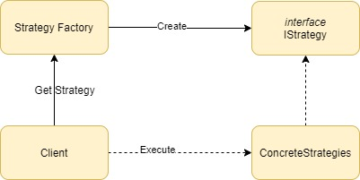

# Design Patterns: Strategy

It is a behavioral project pattern that enable selecting an algorithm at runtime.

## Characteristics
* **Strategy**: It is a common interface/absctract class. It declares a method. 
* **Concrete Strategy**: Implement different variations of an algorithm.
* **Strategy Factory**: It is a factory that creates an concrete strategy at runtime.
* **Client**: The beginning of all. It calls the strategy's factory and then invoke the strategy.



It is important to mention that there are differents way to create the strategy flow.

## Hands-on
The goal of this project is just to show the strategy flow's implementation.

### Commands Implementation
We need to create the interface/absctract class ICalculateSalaryStrategy, which will contain all the method that we will need:
```rb
public interface ICalculateSalaryStrategy
{
    double Calculate(Employee employee);
}
```
Note that we have one method:
* **Calculate()**: Define the method that each concrete strategy classes will implement.

Next, let's create both concrete strategy classes *CalculateSalaryPermanentStrategy* and *CalculateSalaryPermanentStrategy*, they are responsible for implementing the business logic:
```rb
public class CalculateSalaryPermanentStrategy : ICalculateSalaryStrategy
{
    public double Calculate(Employee employee)
    {
        // ... do something
        Console.WriteLine("Calculating permanent employee salary...");
        return double.MaxValue;
    }
}

public class CalculateSalaryCasualStrategy : ICalculateSalaryStrategy
{
    public double Calculate(Employee employee)
    {
        // ... do something
        Console.WriteLine("Calculating casual employee salary...");
        return double.MaxValue;
    }
}
```

Then we create the *CalculateSalaryStrategyFactory* which are responsible for creating the concrete strategy class. In this example the concrete strategy class is created according to ContractType enum:
```rb
public static ICalculateSalaryStrategy GetCalculateSalaryStrategy(ContractType type) =>
    type switch
    {
        ContractType.Permanent => new CalculateSalaryPermanentStrategy(),
        ContractType.Casual => new CalculateSalaryCasualStrategy(),
        _ => throw new NotImplementedException()
    };
```

And finally, the client class that calls the factory class to get a specific strategy, then calls Calculate method from the strategy class:
```rb
public class EmployeeService
{
    public double CalculateSalary(Employee employee)
    {
        var calculateSalaryStrategy =
        CalculateSalaryStrategyFactory.GetCalculateSalaryStrategy(employee.ContractType); 
        return calculateSalaryStrategy.Calculate(employee);
    }
}
```

### The execution

We create two employees, each one has a different contract type, when EmployeeService is called for each employee we can see that concrete strategy class is called according to employee's contract type.

```rb
class Program
{
    static void Main(string[] args)
    {
        var employeeService = new EmployeeService();
           
        var employeeJessy = new Employee("Jessy", ContractType.Permanent); 
        Console.WriteLine($"Jessy salary is: {employeeService.CalculateSalary(employeeJessy)}");
           
        var employeeMeg = new Employee("Meg", ContractType.Casual); 
        Console.WriteLine($"Jessy salary is: {employeeService.CalculateSalary(employeeMeg)}");
    }
}
```

#### Case Study 🤔
This is very useful when there are two or more different ways of doing the same thing, instead of inserting the condition "if" in the middle of the business logic to verify each possible way, we can split in some classes and at runtime create the specific class. 

## Conclusion
* Isolate a business implementation.
* Open/Close principle, we can create a new concrete strategy without having to change the others.
* It is easier to test because each business implementation will be isolated.

---

### References
* [Refactoring Guru - Design Pattern Command](https://refactoring.guru/design-patterns/strategy)
* [Using the Strategy Pattern (Examples in C#)](https://dev.to/sam_ferree/using-the-strategy-pattern-examples-in-c-4jn6)